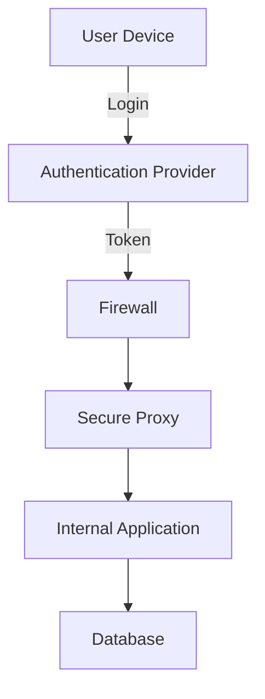
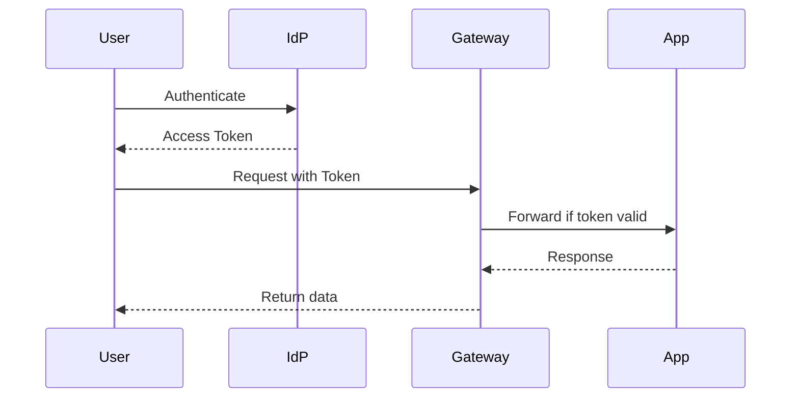

# 🧭 IT Security Architecture Diagram (Mermaid)

Below is a basic security architecture using a **Mermaid diagram**, rendered automatically in MkDocs Material.

---

## 🔄 Data Flow Diagram (Zero Trust)

---

## 📌 Notes

!!! tip
    Diagrams are **just Markdown** — no external tooling required. You can document and visualize directly in your docs.
